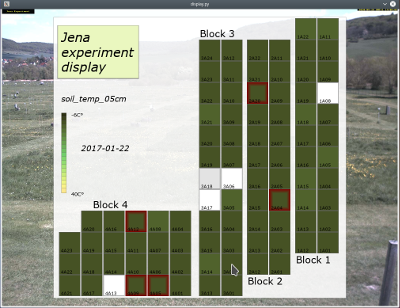

# Jena experiment display



This repository provides a script to animate numerical data associated with Jena Experiment plots. Animations can also be saved as videos.

## Installation

Clone this repository, create and activate your Python environment (conda or virtualenv), then run:

```
conda env create -f environment.yml
```

## Basic functionality

Run:

```
python display.py --path sources/example_format.csv --what 2
python display.py --path sources/field_diversity.csv --what --static 2 # static case
```

The script loads the CSV specified by `--path`, computes a color range, and animates the data. Specify which column to display using the column index passed to `--what`.

## Table format

The table must include a `datetime` column specifying time and a `plotcode` column specifying the plot. See `example_format.csv` for reference.

## Additional options

The script supports the following options:

Add if you want to display a variable with no time dimension:
```
 --static
```

Add if you want to average the data over diversity levels:
```
 --averaging
```

Specifies how many colors are used for the heat map (default = 20):
```
 --heat_boxes int
```

Specifies the speed of the animation (time between frame changes in seconds; default = 0.1):
```
 --speed float
```

Specifies how plots are grouped. `real` displays the original layout; `diversity` groups by diversity levels (default = "real"):
```
 --layout diversity/real/block2
```

Specifies the path to the color palette used for the heat map. There are three preset color ranges in /heats. You can also create your own using https://github.com/hihayk/scale and save the color codes to a .txt file:
```
 --heat path
```

Add if you want to display numeric values on the plots:
```
 --display_values
```

Add if you want to prevent caching of the table (caching speeds up the script for large tables):
```
 --no_csv_cash
```

Specifies the color used for missing values. Provide RGB values; defaults to white (255, 255, 255):
```
 --nan_color 255 255 255
```

Specifies the lower and upper boundaries for displaying extreme values. Defaults to (-1., 30.0):
```
 --up_extreme float/int  --low_extreme float/int
```

Specifies the first and last time step to animate. If not specified, all data is animated:

```
 --start int   --end int
```

Add if you want to record the animation (saved under /videos):
```
 --record
```

Specifies the unit to display (default = °C):
```
 --unit str
```

## Example usage

```
cd jena_experiment_display
python display.py --path sources/example_format.csv --what 2 --layout diversity --display_values --nan_color 128 0 256 --up_extreme 4.0 --speed 0.5
```

###### Feel free to contact me if you have any questions.
Specifies the unit that is displayed (Defaults to °C)

```
